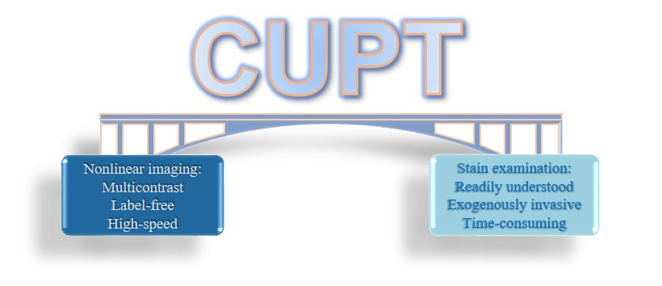
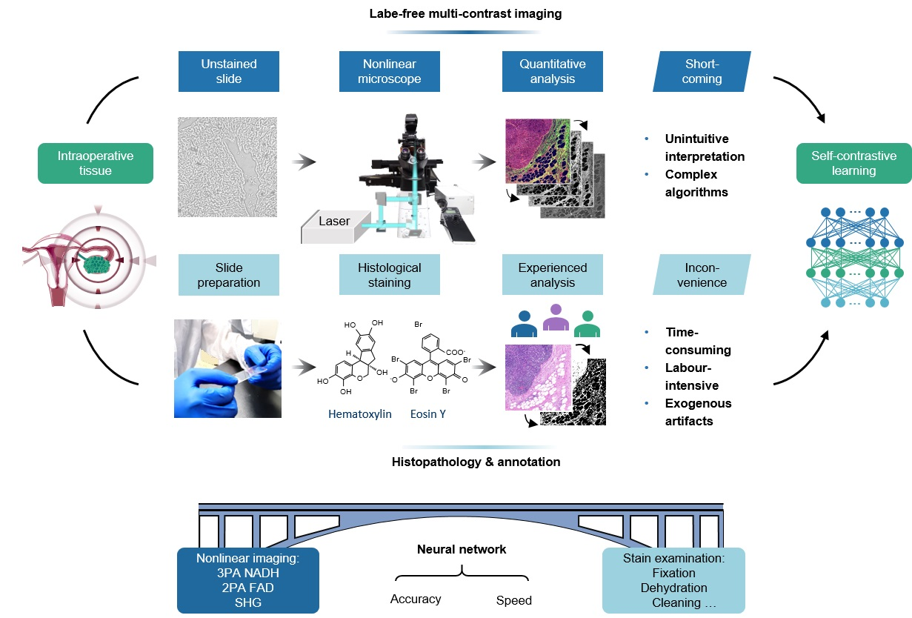

<p align="center">
  
</p>

This project hosts the scripts for training and testing contrastive unregistered patchwise-learning translation (CUPT) network, as presented in our paper: B. Shen, Y. Li, Y. Pan, Y. Guo, Y. Lu, R. Hu, J. Qu, L. Liu, Nonlinear optical imaging-based intelligent vision for fast intuitive label-free cancer diagnosis and tumor heterogeneous analysis.


## Introduction

Label-free multiphoton (MP) excitation microscopy has emerged as a powerful tool for visualizing biological structure at the molecular scale and quantifying tumor heterogeneity despite the uncommon and unintuitive interpretation of tumor microenvironment. We combine real-time multi-contrast multiphoton imaging and self-contrastive deep learning to realize histopathology-like visualization, structural mapping, and heterogeneous analysis of clinicopathological tissues. We demonstrate MP imaging-based histology (MPH) of intraoperative ovarian tissues with high authenticity and accuracy, which show superior performance to other widely used models. The virtual histology can be used for cancer staging with a combination of the simultaneously collected nonlinear signals. Moreover, the heterogeneity within tumors including different shapes of nuclei can be revealed by the label-free bio-structural segmentation. These are challenging without involvement of staining. Thereby, the self-contrastive deep learning method improves the readability and understanding of data of the optical microscopy, and hence enables toilless histological biomedical examination and nuclear heterogeneous analysis of tumor microenvironment.

<p align="center">
  
</p>

## MP, MPH and histopathological staining workflows and the corresponding results. 
Label-free multi-contrast MP imaging procedure for quantitative analysis and standard histopathological procedure for experienced examination and structural annotation. The MP and histopathological images were trained in the self-contrastive learning network. 
Top: neural network as bridge connects the MP imaging and the conventional histopathology with high accuracy and speed. 
Bottom: label-free MP image, inferred MPH image, and histopathological image of a normal ovarian tissue.

<p align="center">
  
</p>

## Network
📕 Dependencies and Installation

Python >= 3.7 (Recommend to use [Anaconda](https://www.anaconda.com/download/#linux) or [Miniconda](https://docs.conda.io/en/latest/miniconda.html))
- [PyTorch >= 1.3](https://pytorch.org/)
- NVIDIA GPU + [CUDA](https://developer.nvidia.com/cuda-downloads)

1. Clone repo

    ```bash
    git clone https://github.com/shenblin/NOCV.git
    ```

2. Install dependent packages

    ```bash
    pip install -r requirements.txt
    pip install torch==1.7.1+cu110 torchvision==0.8.2+cu110 -f https://download.pytorch.org/whl/torch_stable.html
    ```
   
📕 Dataset Preparation

The input and ground truth paired images should have the same name.


⚡ Train and Test

- **Training and testing commands**: For single gpu, use the following command as example:
1. **Training**
    ```bash
    python train.py --dataroot datasets/train_dataset/MP_to_HE/Ovarian/ovarian_RGB --name MP_to_HE --no_flip
    ```
2. **Testing**
    ```bash
    python test.py --dataroot datasets/test_dataset/MP_to_HE/ --name MP_to_HE --phase test --results_dir result_tiles
    ```
    Breast
    ```bash
    python test.py --dataroot datasets/test_dataset/breast/Breast_RG/breast --name 2PA_SHG_to_HE --phase test --results_dir result_tiles/1/
     ```
    Skin
    ```bash
    python test.py --dataroot datasets/test_dataset/Skin/Skin_RG/Skin --name 2PA_SHG_to_HE --phase test --results_dir result_tiles/5/
     ```
    Segmentation
    ```bash
    python test.py --dataroot datasets/test_dataset/Nuclei_inpainting/Ovarian/ovarian_RGB_exp/ovarian_1 --name Nuclei_inpainting_MP --phase test --results_dir result_tiles
     ```
    Denoising
    ```bash
   python test.py --dataroot datasets/test_dataset/image_enhancement/resonant_4X/ovarian_1 --name image_enhancement --phase test --results_dir result_tiles
     ```
📢 Results

For more results and further analyses, please refer to our paper.


📜 Acknowledgement

Thanks [paper](https://arxiv.org/pdf/2007.15651) authers for the wonderful open source project!


🌏 Citations

If you find this work useful in your research, please consider citing the paper:

B. Shen, et al.

📧 Contact

If you have any questions, please email `shenblin@foxmail.com`.
