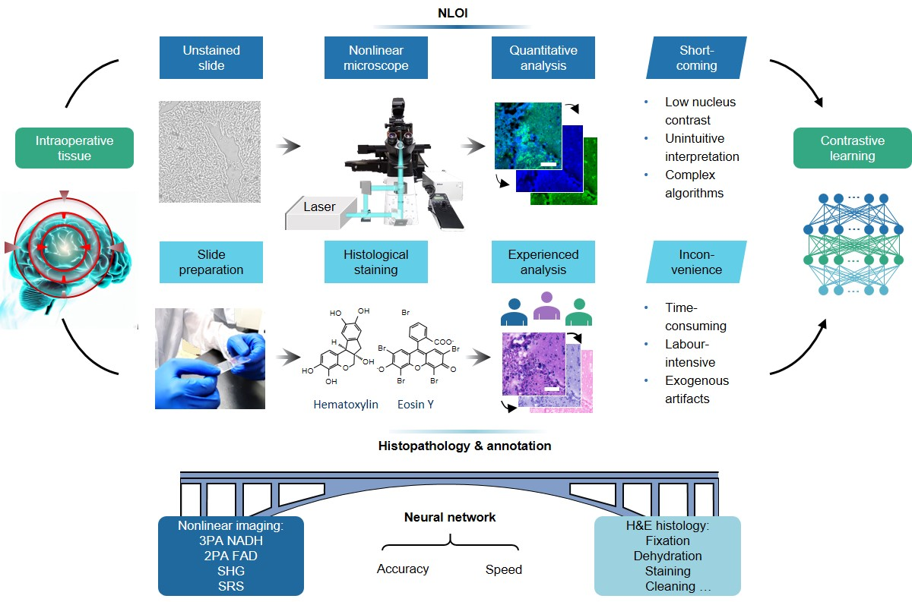

## Noninvasive Nonlinear Optical Computational Histology

This project hosts the scripts for training and testing unregistered contrastive patchwise-learning translation network, as presented in our [Paper]().


## Introduction

Cancer remains a global health challenge, demanding early detection and accurate diagnosis for improved patient outcomes. We introduce an intelligent paradigm that elevates label-free nonlinear optical imaging with contrastive patch-wise learning, yielding stain-free nonlinear optical computational histology (NOCH). NOCH enables swift, precise diagnostic analysis of fresh tissues, reducing patient anxiety and healthcare costs. We evaluated nonlinear modalities, including stimulated Raman scattering and multiphoton imaging, for their ability to enhance tumor microenvironment sensitivity, pathological analysis, and cancer examination. Quantitative analysis confirmed NOCH images accurately reproduce nuclear morphometric features across different cancer stages. Key diagnostic features, such as nuclear morphology, size, and nuclear-cytoplasmic contrast, were well preserved. NOCH models also demonstrate promising generalization when applied to other pathological tissues. Our study unites label-free nonlinear optical imaging with histopathology using contrastive learning to establish stain-free computational histology. NOCH provides a rapid, non-invasive, and precise approach to surgical pathology, holding immense potential for revolutionizing cancer diagnosis and surgical interventions.

<p align="center">
  
</p>

## NLOI, NOCH and histopathological staining workflows 
Label-free multi-contrast nonlinear imaging procedure for quantitative analysis and standard histopathological procedure for experienced examination and structural annotation. The multimodal multiphoton (MP) images and stimulated Raman scattering (SRS) images were converted into and histopathological images with the contrastive learning network. 
Top: neural network as bridge connects the label-free nonlinear optical imaging and the conventional histopathology with high accuracy and speed. 
Bottom: label-free MP image, inferred NOCH image, and histopathological image of a normal ovarian tissue.

<p align="center">
  
</p>

## Network
📕 Dependencies and Installation

Python >= 3.7 (Recommend to use [Anaconda](https://www.anaconda.com/download/#linux) or [Miniconda](https://docs.conda.io/en/latest/miniconda.html))
- [PyTorch >= 1.3](https://pytorch.org/)
- NVIDIA GPU + [CUDA](https://developer.nvidia.com/cuda-downloads)

1. Clone repo

    ```bash
    git clone https://github.com/shenblin/NOCH.git
    ```

2. Install dependent packages

    ```bash
    pip install -r requirements.txt
    pip install torch==1.7.1+cu110 torchvision==0.8.2+cu110 -f https://download.pytorch.org/whl/torch_stable.html
    ```

## Train and Test
 
📕 Dataset Preparation

Please refer to [Checkpoints](checkpoints/Checkpoints_Download.md) for the pretrained checkpoints.

Please refer to [DataPreparation](datasets/README.md) for data downloading. The input and ground truth paired images should have the same name.


⚡ **Training and testing commands**: For single gpu, use the following command as example:
1. **Training**
    ```bash
    python train.py --dataroot datasets/train_dataset/Brain_SRS/SRS --name SRS_to_HE --save_epoch_freq 1
    ```
   ```bash
    python train.py --dataroot datasets/train_dataset/Brain_SRS/SRS --name SRS_to_HE_cross_contrastive --save_epoch_freq 1 --nce_includes_all_negatives_from_minibatch True --batch_size 3
    ```
    ```bash
    python train.py --dataroot datasets/train_dataset/Ovarian/MP_to_HE/ovarian_RGB --name MP_to_HE
    ```
    ```bash
    python train.py --dataroot datasets/train_dataset/Ovarian/MP_to_HE/ovarian_RGB --name MP_to_HE_cross_contrastive --nce_includes_all_negatives_from_minibatch True --batch_size 2
    ```
3. **Testing**
    ```bash
    python test.py --dataroot datasets/test_dataset/Brain_SRS/002 --name SRS_to_HE --phase test --results_dir result_tiles/2/  --epoch 26
    ```
    ```bash
    python test.py --dataroot datasets/test_dataset/Brain_SRS/002 --name SRS_to_HE_cross_contrastive --phase test --results_dir result_tiles/2/  --epoch 25
    ```
    ```bash
    python test.py --dataroot datasets/test_dataset/Ovarian/MP_to_HE/ovarian_RGB/ovarian_1 --name MP_to_HE --phase test --results_dir result_tiles/1/ --epoch 80
    ```
    ```bash
    python test.py --dataroot datasets/test_dataset/Ovarian/MP_to_HE/ovarian_RGB/ovarian_1 --name MP_to_HE_cross_contrastive --phase test --results_dir result_tiles/1/ --epoch 80
    ```
    
For more large-image tests please refer to [SRS to HE](run_SRS_to_HE.sh) and [MP to HE](run_MP_to_HE.sh).


## Results

<p align="center">
  
</p>

Label-Free neurosurgical pathology using NOCH. 
a–c, g–i, Glioblastoma IV; d–f, j–l, Oligoastrocytoma II–III. The unstained SRS images (a,d,g,j) were merged by protein (green) and lipid (blue) image. The NOCH network inferences (b,e,h,k) closely mirror the corresponding pathological morphology observed in the H&E histopathology. (c,f,i,l). Scale bar, 100 μm in a–f, 40 μm in g–l.

___________________________________________________________________________________________________________________________

<p align="center">
  
</p>

Comparison of NOCH results of different networks. 
a, The SRS spectrum of lipid (blue) and protein (green), which compose the SRS images. b, Cycle-consistent module which transforms images between the two domains. c, Self-contrastive loss associating the sampled query and its positive, in contrast to negatives within the same image. d, Cross-contrastive loss associating the sampled query and its positive, in contrast to negatives from different images. Second to fourth columns present the virtually histological results. e, Conventional H&E histology including fixing tissue slide in acetic acid, staining with hematoxylin and eosin mixture, dehydrating with ethanol, and cleaning with xylene. Second to fourth columns correspond to the bright-field H&E images for reference. Scale bar, 50 μm.


📢 **For more results and further analyses, please refer to our paper.**


## License

📜 This project is released under the [LICENSE](LICENSE).<br>

 ## Citation

If you find this work useful in your research, please consider citing the paper:

B. Shen, et al.

📧 Contact

If you have any questions, please email `shenblin@foxmail.com`.
